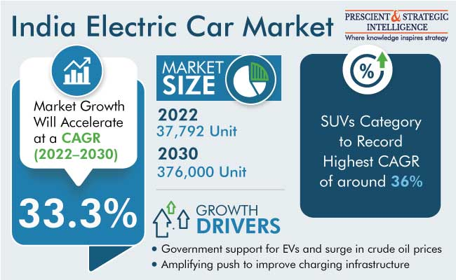

<h1 align="centre"> Electric Vehicle Market Segmentation </h1>
<h5> Market Segmentation is a crucial aspect for any industry, as it helps understand and cater to diverse needs and choices of customer groups.
Businesses can then issue resources and create customised marketing strategies to attend different demands of every customer
by segmenting according to customer preferences.
This helps in attracting new customers, while not letting go of the current customers and concentrating on that particular sengmentation of potential customers 
not entertained in the past. By customizing we can meet specific requirements of different classes of customers and transportation companies may enhace their business and customer satisfcation hence creating a foundation for other marketing tactics.</h5>

## Table of Contents

- [Overview](#Overview)
- [Market Dynamics](#Market-Dynamics)
- [Market Challenges](#Market-challenges)
- [Libraries Used](#Libraries-Used)
- [Data Preprocessing](#Data-Preprocessing)
- [Prerequisites](#prerequisites)
- [Dataset Link](#Dataset-Link)
- [Results](#Results)
- [Future Goals](#Future-Goals)
- [About Me](#About-Me)
- 

## Overview

  </img>

## Market Dynamics
## Market Challenges
  
## Libraries Used

- **[SKLearn](https://scikit-learn.org/stable/):** Efficient tools for predictive data analysis
- **[Seaborn](https://seaborn.pydata.org/):**
  Seaborn is a Python data visualization library based on matplotlib. It is used for making statistical visualizations. For Example, graphs that show relationships between two variables in a dataset.  
- **[Plotly](https://plotly.com/python/getting-started/):**
  The plotly Python library is an interactive, open-source plotting library that creates line charts, scatter plots, etc. and can be embedded on websites that can be zoomed in, rotated, and explore in many more ways.
- **[Matplotlib](https://matplotlib.org/) :** Matplotlib is a library for creating static visualizations in Python.
- **[Numpy](https://www.geeksforgeeks.org/introduction-to-numpy/):**
  Numpy is a general-purpose array-processing package.It provides a high-performance multidimensional array object and tools for working with these arrays.
- **[Pandas](https://www.geeksforgeeks.org/introduction-to-pandas-in-python/):**
  Pandas is used for working with datasets usinf functions such as cleaning, exploring and manipulation.

## Data Preprocessing
## prerequisites
## Dataset Link
## Results
## Future Goals
## About Me
